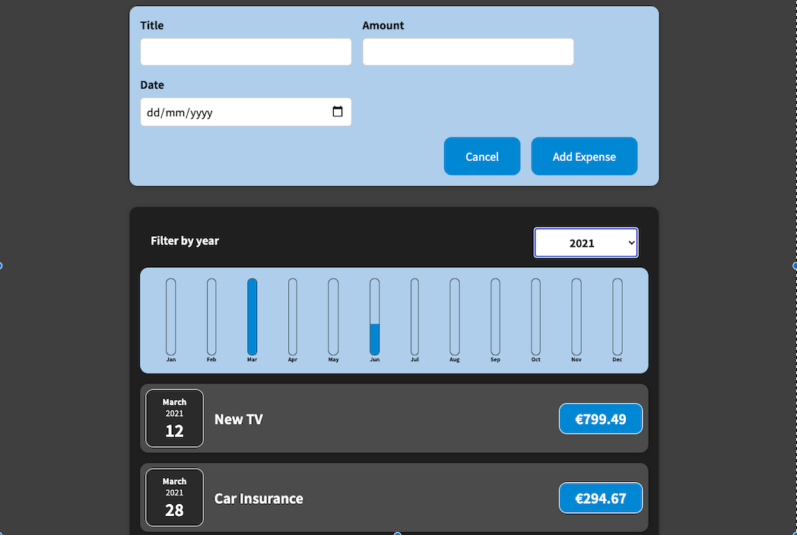

# Expenses-APP

## Table of contents

- [General info](#general-info)
- [Screenshots](#screenshots)
- [Technologies](#technologies)
- [Setup](#setup)
- [Status](#status)
- [Contact](#contact)

## General info

> This is a react front-end app. The App is called "Expenses-APP" and it is a simple list of expenses by year that allows the users to see/add and filter by year  their expenses.
## Screenshots

## Technologies

- React 17.0.2
- VSC code
- JavaScript
- Heroku

## Setup

- `run npm start` 
- `npm start`

## Status

Project is: _finished_

## Contact

By Krystyna Miliutyna

